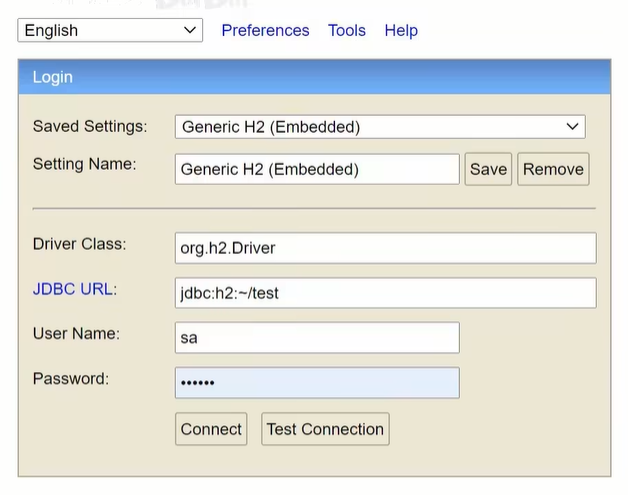
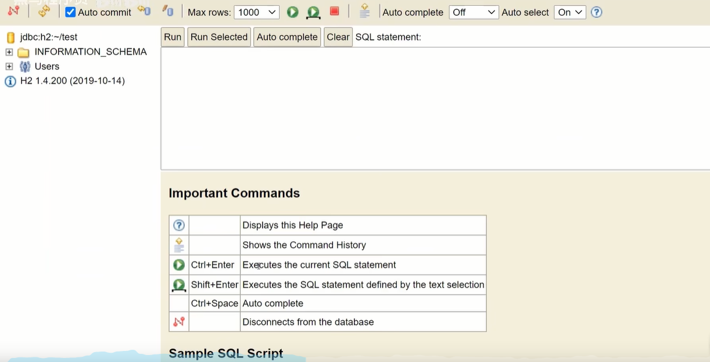

# **实用开发篇**

====

## 1. H2 数据库

### 1.1 首先需要在 pom.xml 文件中配置 maven 插件

```XML
<dependency>
    <groupId>com.h2database</groupId>
    <artifactId>h2</artifactId>
</dependency>
```
### 1.2 在pom.xml中添加Web环境

```XML
<dependency>
    <groupId>org.springframeword.boot</groupId>
    <artifactId>spring-boot-starter-web</artifactId>
</dependency>
```
### 1.3 在application.yml配置文件中配置相应的属性值
```yml
spring:
      h2: 
    console: 
         path: /h2
         enabled: true
```
### 1.4 浏览器访问地址：localhost/h2即可访问



### 1.5 在1.3的配置后 访问出错需要在spring下面继续配置datasource 进行初始化 初始化之后就可以省略datasource了 完整代码

```yml
spring:
      h2: 
    console: 
         path: /h2
         enabled: true
    datasource:
         url: jdbc:h2:~/test
         hikari:
               driver-class-name: org.h2.Driver
               username: sa
               password: 123456
```
### 1.6 配置完成后进入浏览器点击连接 即可进入界面



### 1.7 弄好后需要使用create添加相应的表 然后在测试类中进行测试
```java
  @Test
  void testJdbcTemplateSave(@Autowired JdbcTemplate jdbcTemplate) {
    // 相应的sql处理
    String sql = "insert into tbl_book values (3,'springboot1','springboot2','springboot3')";
    jdbcTemplate.update(sql);
  }
```

## 2. SpringBoot整合Redis