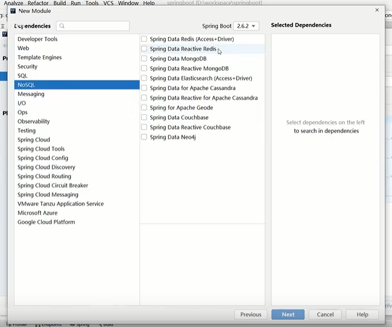
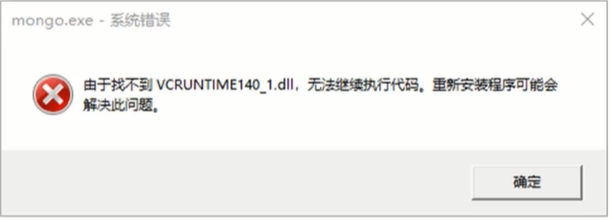

# **实用开发篇**

## 1. H2 数据库

### 1.1 首先需要在 pom.xml 文件中导入坐标

```XML
<dependency>
    <groupId>com.h2database</groupId>
    <artifactId>h2</artifactId>
</dependency>
```

### 1.2 在 pom.xml 中添加 Web 环境

```XML
<dependency>
    <groupId>org.springframeword.boot</groupId>
    <artifactId>spring-boot-starter-web</artifactId>
</dependency>
```

### 1.3 在 application.yml 配置文件中配置相应的属性值

```yml
spring:
      h2:
    console:
         path: /h2
         enabled: true
```

### 1.4 浏览器访问地址：localhost/h2 即可访问


### 1.5 在 1.3 的配置后 访问出错需要在 spring 下面继续配置 datasource 进行初始化 初始化之后就可以省略 datasource 了 完整代码

```yml
spring:
      h2:
    console:
         path: /h2
         enabled: true
    datasource:
         url: jdbc:h2:~/test
         hikari:
               driver-class-name: org.h2.Driver
               username: sa
               password: 123456
```

### 1.6 配置完成后进入浏览器点击连接 即可进入界面


### 1.7 弄好后需要使用 create 添加相应的表 然后在测试类中进行测试

```java
  @Test
  void testJdbcTemplateSave(@Autowired JdbcTemplate jdbcTemplate) {
    // 相应的sql处理
    String sql = "insert into tbl_book values (3,'springboot1','springboot2','springboot3')";
    jdbcTemplate.update(sql);
  }
```

## 2. SpringBoot 整合 Redis

### 2.1 Redis 的下载安装和基本使用

- 下载地址（windows 版）：[Redis 下载](https://github.com/tporadowski/redis/release)
- 服务端启动命令 当前的安装目录下执行。

```command
redis-server.exe redis.windows.conf
```

- 客户端启动命令，当前的安装目录下执行，刚开始初始化运行时需要先执行 shutdown 和 exit 在执行上面命令才会运行成功。

```command
redis-cli.exe
输入命令：shutdown
再次输入：exit
```

### 2.2 基本命令使用

| 命令                   | 说明               |
| ---------------------- | ------------------ |
| set key value          | 存值               |
| get key                | 取值               |
| hset key key ··· value | 哈希存值           |
| hget key ···           | 哈希取值           |
| keys \*                | 获取所有的 key     |
| ·········              | 更多，具体查看官网 |

### 2.3 导入 Redis 坐标

- 首先在新建项目时选择项目需要勾 NOSQL 对应的配置插件
  
- 勾选 Spring Data Redis (Access+Driver) 或者 Spring Data Reactive Redis

### 2.4 在 application.yml 中配置 Redis

```yml
spring:
  redis:
    url:
    username:
    host: localhost #ip
    post: 6379 #端口号
```

### 2.5 新建测试类 在测试类中调试 Redis

```java
@SpringBootTest
class SpringbootRedisTest {
  @Autowired
  private RedisTemplate redisTemplate;
  // Redis的set操作
  @Test
  void set(){
    ValueOperations ops = redisTemplate.opsForValue();
    ops.set("age",24);
  }
  // Redis的get操作
  @Test
  void get(){
    ValueOperations ops = redisTemplate.opsForValue();
    ops.get("age");
  }
  // Redis的hset操作
  @Test
  void hset(){
    HashOperations opsh = redisTemplate.opsForHash();
    ops.put("info","a","aa");
  }
  // Redis的hget操作
  @Test
  void hget(){
    HashOperations opsh = redisTemplate.opsForHash();
    ops.get("info",'a');
  }
  ......
}

```

### 2.6 读写 Redis 客户端

```java
@SpringBootTest
class SpringbootRedisTest {

  // (常用)
  @Autowired
  private StringRedisTemplate strRedisTemplate;

  // Redis的set操作
  @Test
  void set(){
    ValueOperations ops = strRedisTemplate.opsForValue();
    ops.set("age",24);
  }
  // Redis的读取操作
  @Test
  void get(){
    ValueOperations<String,String> strops = strRedisTemplate.opsForValue();
    String age =  strops.get("age");
    system.out.println(age)
  }
  ......
}
```

### 2.7 操作 Redis 客户端实现技术切换(jedis)

- pom.xml 配置索引

```xml
<dependency>
    <groupId>redis.clients</groupId>
    <artifactId>jedis</artifactId>
</dependency>
```

- application.yml 添加相应配置

```yml
spring:
  redis:
    host: localhost #ip
    post: 6379 #端口号
    clinet-type: jedis # 默认lettuce
    jedis:
      pool:
        max-active: 16 #最大线程池
```

## 3. MongoDB 数据库的下载与基本使用

### 3.1 简介

- MongoDB 是一个开源，高性能，无模式的文档型数据库。NOSQL 数据库产品中的一种，是最像关系型数据库的非关系型的数据库
- 适用：永久性存储与临时存储相结合，修改频度较高 举例：游戏道具数据，装备数据。直播打赏数据，粉丝数据。
- 适用：临时存储，修改数据飞快 例如物联网数据

### 3.2 下载与安装

- windows 版 Mongo 下载 [Mongo 下载](https://www.mongodb.com/try/download)
- windows 版 Mongo 安装：正常解压或压缩即可，安装后需要在安装目录下新建 data 文件夹用来存储数据。
- windows 版 Mongo 启动

```command
<!-- 服务端启动 -->
mongod --dbpath=..\data\db
<!-- 客户端启动 -->
mongo --host=127.0.0.1 --port=27017
```

- 可视化编译器 robot 和 studio
- 如果安装 Mongo 出现以下错误按需解决
  

1. 下载对应的 dll 文件（通过互联网搜索即可）
2. 拷贝到 windows 安装路径下的 system32 目录中
3. 执行命令注册对应的 dll 文件

```command
regsvr32 vcruntime140_1.dll
```

### 3.3 基本的增删改查

- 增加

```json
db.表名.save({"key","value"})
```

- 删除

```json
db.表名.remove({"key","value"})
```

- 修改

```json
db.表名.update({"key","value"},($set:{"key","value"}))
```

- 查询 所有

```json
db.getCollection('表名').find({})
简写：db.表名.find()
```

### 3.4 导入 MongoDB 坐标

- 首先在新建项目时选择项目需要勾 NOSQL 对应的配置插件
  
- 勾选 Spring Data MongoDB

#### 3.5 在 application.yml 中配置 MongoDB

```yml
spring:
  data:
    mongodb:
      url: mongodb://localhost/数据库名
```

#### 3.6 新建测试类 在测试类中调试 MongoDB

```java
@SpringBootTest
class SpringbootRedisTest {
  @Autowired
  private MongoTemplate mongoTemplate;
  // mongo的save操作
  /*
  * 和mongo中的接口api对应基本是一致
  */
  @Test
  void save(){
    mongoTemplate.save()
  }
   @Test
  void findAll(){
    /*
    * 如果报错是因为mongo中的id值springBoot不支持相应的解析id 需要使用springboot进行最基本的数据添加并配置id
     */
   List<实体类名> all = mongoTemplate.findAll(实体类名.class)
  }
  ......
}

```

## 4. Elasticsearch(ES)的下载与基本使用

### 4.1 简介

- ES 是一个分布式全文搜索引擎

### 4.2 下载和安装

- windows 版 ES 下载[ES 下载](https://www.elastic.co/cn/downloads/elasticsearch)。
- 正常解压，运行。

```command
运行 elasticsearch.bat
```

- IK 分词器下载[IK 分词器](https://github.com/medcl/elasticsearch-analy-ik/releases) 放在 es 目录下的 plugs 文件下新建 ik 文件夹，解压到当前目录。

### 4.3 索引的基本操作

- 直接使用 PostMan 的 Put 访问接口 http://localhost:9200/books 即可添加索引 _注意_ 不可重复添加同名称索引
- GET：http://localhost:9200/books 访问即可访问同索引下的数据
- DELETE: http://localhost:9200/books 删除索引
- 对应索引添加属性

```json
/**
id name type remark 为实体类中的名称，按需求修改
all 为虚拟字段，把name和remark集合在一起 在查询中使用
all名称自定义 copy_to指向即可
*/
{
  // 固定字段
  "mappings": {
    // 固定属性字段
    "properties": {
      // 元素名
      "id": {
        // 设置id为关键字
        "type": "keyword"
        // index:false 不想查询配置index:false
      },
      "name": {
        // name为文本信息 当前字段可以被分词
        "type": "text",
        // 使用分词器的插件
        "analyzer": "ik_max_word",
        "copy_to":"all",
      },
      "type":{
          "type": "keyword"
      },
      "remark":{
        "type": "text",
        "analyzer": "ik_max_word",
        "copy_to":"all",
      },
      "all":{
        "type": "text",
        "analyzer": "ik_max_word"
      },
      ......
    }
  }
}
```

### 4.3 文档的基本操作

- 直接使用 PostMan 的 POST 访问接口 http://localhost:9200/books/\_doc 或者 http://localhost:9200/books/\_create/2 即可添加成功 加/2 为当前文档的指定 id

```json
/*
* 即可添加文档
* 选择raw JSON格式传值
*/

{
 "key":"value"
 ......
}
```

- PUT:http://localhost:9200/books/\_doc/1 修改属性值 1 为想要修改的 id 值，json 里面传什么修改什么。

```json
/*
* 全覆盖修改，全部修改。
* 选择raw JSON格式传值
*/

{
 "key":"value"
 ......
}
```

- PUT:http://localhost:9200/books/\_update/1 修改属性值 1 为想要修改的 id 值，json 里面传什么修改什么。

```json
/*
* 以文档的形式进行修改，传什么改什么。
* 选择raw JSON格式传值
*/

{
  "doc":{
    {
       "key":"value"
        ......
    }
  }
}
```

- GET：http://localhost:9200/books/\_doc 访问即可访问文档下的数据 加上/1 就是指定 id 为 1 的文档数据
- GET：http://localhost:9200/books/\_search 查询全部 后面添加?q=属性名:属性值 可查询
- DELETE: http://localhost:9200/books/\_doc 删除索引 加上/1 就是指定 id 为 1 的文档数据
- 对应索引添加属性

### 4.4 首先需要在 pom.xml 文件中导入坐标

```XML
<!-- 低级别需要的 不适用 -->
<dependency>
    <groupId>org.springframework.boot</groupId>
    <artifactId>spring-boot-starter-data-elasticsearch</artifactId>
</dependency>
<!-- 高级别 -->
<dependency>
    <groupId>org.elasticsearch.client</groupId>
    <artifactId>elasticsearch-rest-high-level-client</artifactId>
</dependency>
```

### 4.5 在 application.yml 配置文件中配置相应的属性值

```yml
#  低级别需要的 不适用
spring:
  elasticsearch:
    rest:
      uris: http:localhost:9200 #9200 为es的服务器端口号
```

### 4.6 新建测试类 在测试类中调试 ES

```java
// 低级别
@SpringBootTest
class SpringbootESTest {
  @Autowired
  private ElasticsearchRestTemplate esTemplate;
  @Test
  void fn(){
      esTemplate.search();
  }
  ......
}

```
- 高版本的具体查看网站新的写法，因为有部分的已经过时


